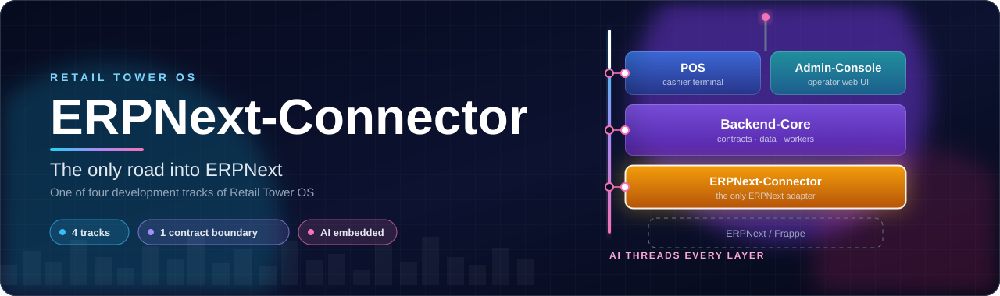
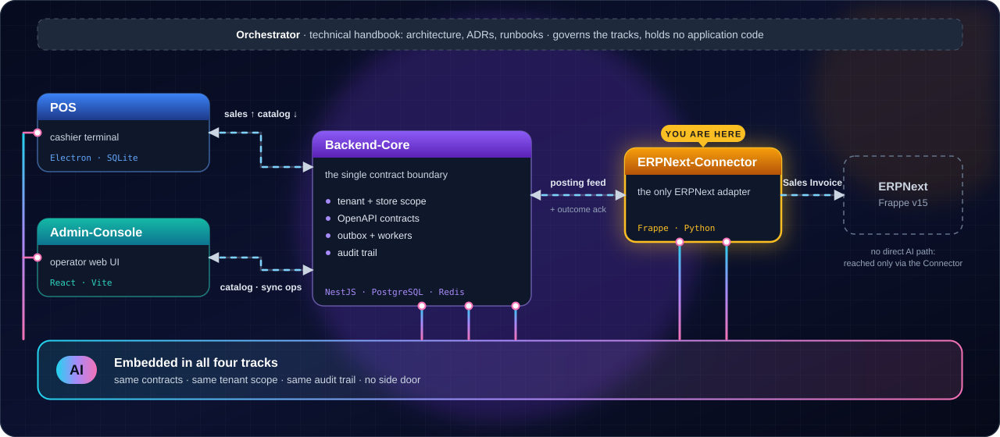
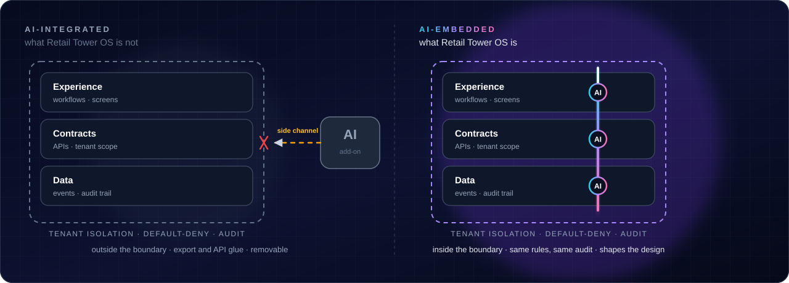

<div align="center">

<h1 align="center">
  
</h1>

<p align="center">
  <a href="#-one-project-four-tracks"></a>
  <a href="#-ai-is-native-to-the-architecture-and-the-design"></a>
  <a href=".specify/memory/constitution.md"></a>
  <a href="docs/decisions"></a>
  <a href=".specify/memory/constitution.md"></a>
  <a href="retail_tower_erpnext_connector/connector/posting/poller.py"></a>
  <a href="#known-gaps-and-gated-work"></a>
  <a href="LICENSE"></a>
</p>

<p align="center">
  <a href="docs/decisions/version-pin-upgrade-policy.md"></a>
  <a href="docs/decisions/version-pin-upgrade-policy.md"></a>
  <a href="pyproject.toml"></a>
  <a href="retail_tower_erpnext_connector/hooks.py"></a>
  <a href="#what-the-connector-posts-today"></a>
  <a href="retail_tower_erpnext_connector/connector/bin_view/poller.py"></a>
</p>

<p align="center">
  <a href="#-one-project-four-tracks"><b>Tracks</b></a> &nbsp;·&nbsp;
  <a href="#-ai-is-native-to-the-architecture-and-the-design"><b>AI</b></a> &nbsp;·&nbsp;
  <a href="#current-implementation-status"><b>Status</b></a> &nbsp;·&nbsp;
  <a href="#role-and-boundaries"><b>Sync</b></a> &nbsp;·&nbsp;
  <a href="#getting-started"><b>Get started</b></a> &nbsp;·&nbsp;
  <a href="docs/architecture"><b>Docs</b></a>
</p>

</div>

> **Retail Tower OS** is the product; this repository, [`Kemetra/ERPNext-Connector`](https://github.com/Kemetra/ERPNext-Connector), is its ERPNext integration track and the only ERPNext/Frappe adapter. It talks to [`Kemetra/Backend-Core`](https://github.com/Kemetra/Backend-Core) only.
>
> *Also known as:* Data-Pulse-2 / DP2 = Backend-Core; POS-Pulse = POS; Retail-Tower-Console = Admin-Console. Code and configuration still use the `dp2_*` names (for example the `dp2_base_url` setting).

---

## 🧩 One project, four tracks

<p align="center">
  
</p>

| Track | Repository | Owns |
| --- | --- | --- |
| **Backend-Core** | [`Kemetra/Backend-Core`](https://github.com/Kemetra/Backend-Core) | APIs · data · workers · tenant/store context · sync operations |
| **POS** | [`Kemetra/POS`](https://github.com/Kemetra/POS) | Windows cashier terminal · offline state · receipts |
| **Admin-Console** | [`Kemetra/Admin-Console`](https://github.com/Kemetra/Admin-Console) | Operator web UI · catalog · inventory views · sync ops |
| **ERPNext-Connector** ◀ you are here | [`Kemetra/ERPNext-Connector`](https://github.com/Kemetra/ERPNext-Connector) | The only ERPNext/Frappe adapter · DocType mapping · posting |

<sub>One architecture, one set of contracts, one AI-embedded design. POS and Admin-Console both synchronize through Backend-Core, the single contract boundary, which alone reaches ERPNext through this connector ([flow and boundaries](#role-and-boundaries)). <a href="https://github.com/Kemetra/Orchestrator"><code>Kemetra/Orchestrator</code></a> is the technical handbook, not a track.</sub>

---

## 🧠 AI is native to the architecture and the design

<p align="center">
  
</p>

<table>
<tr>
<td width="25%" valign="top"><b>🔒 Same boundary</b><br/><sub>Talks to Backend-Core only: pull feed plus outcome acknowledgement. No direct path to ERPNext for anyone else, no side door.</sub></td>
<td width="25%" valign="top"><b>🧾 Auditable</b><br/><sub>The ERPNext document carries source system, external id and sale reference as Custom Fields; the Posting Log records source system, external id, document reference and outcome.</sub></td>
<td width="25%" valign="top"><b>🏢 Tenant-safe</b><br/><sub>Fail-closed on an unmapped store, unit, tender or Item: rejected with a structured reason, never guessed.</sub></td>
<td width="25%" valign="top"><b>🧑‍⚖️ Human-governed</b><br/><sub>Authority, scope and approval stay with people. Operators own the mapping tables and credentials; AI works inside them.</sub></td>
</tr>
</table>

> AI-embedded describes the architectural and design direction. **This repository contains no AI-driven behavior today**; what is shipped is tracked in [Current implementation status](#current-implementation-status) and under [`specs/`](specs).

---

## Role and boundaries

Retail Tower OS uses ERPNext as its ERP, accounting and inventory reference system, but ERPNext
does **not** replace the Retail Tower operational applications. This connector keeps the ERPNext
integration isolated, versioned, testable and upgrade-safe. It is the **only** component allowed to
touch ERPNext, and the integration rule is one direction, through one boundary: Backend-Core (see the
tracks diagram above).

This repository owns the custom Frappe app `retail_tower_erpnext_connector`. It owns:

- the ERPNext / Frappe custom app foundation and its install / upgrade policy;
- Connector Settings: Backend-Core endpoint, credential references and the posting maps;
- authentication **to** Backend-Core as a machine principal (the connector is the client; Backend-Core makes no outbound calls);
- the sales posting adapter (Sales Invoice, void credit note, partial return): it pulls posting work items from Backend-Core's posting feed (capture-UP), applies the ERPNext Item reference that Backend-Core has already resolved for each line, posts the document to ERPNext and acknowledges the outcome, with idempotency and failure classification;
- the stock-view (Bin) read-and-report leg: it answers Backend-Core's stock-view requests by reading ERPNext Bin on-hand and reporting it back;
- ERPNext-specific mapping and extension points.

### Non-goals

- Do not fork ERPNext, do not copy ERPNext core code into this repository, and do not export catalog out of ERPNext.
- Do not implement the POS cashier UI or the Admin-Console here.
- Do not let POS or Admin-Console call Frappe directly.
- Do not bypass Backend-Core contracts.
- Do not resolve, search for, create or substitute ERPNext Items: Backend-Core is the Retail Tower catalog authority and supplies the Item reference.
- Do not perform production ERPNext upgrades without staging gates.

ERPNext POS is a business-behavior reference only (POS Profile, POS Invoice lifecycle, closing
entries, payment methods, return behavior). It is never the production Retail Tower cashier.

---

## Current implementation status

> **Source of truth.** GitHub `main` is the technical truth for what is implemented; active work and
> priorities are tracked in Jira (project **RT**). The `Status:` headers inside `specs/*/spec.md`
> were written at spec time and often lag the code (for example 001 to 004 still read "Draft"), and
> `wave-status.md` files are historical logs. The tables below are derived from the Python package,
> `hooks.py` and tests on `main`. Re-verify before relying on them.

### Specs

| Spec | Folder | State on `main` |
| --- | --- | --- |
| 001 Frappe App Foundation | [`specs/001-frappe-app-foundation`](specs/001-frappe-app-foundation) | Implemented: app scaffold, `required_apps = ["erpnext"]`, Connector Settings DocType, version-pin and upgrade policy ([docs](docs/decisions/version-pin-upgrade-policy.md)) |
| 002 DocType Mapping Reference | [`specs/002-doctype-mapping-reference`](specs/002-doctype-mapping-reference) | Documentation only: [mapping matrix](docs/architecture/doctype-mapping-reference.md) and signed decisions ([customer](docs/decisions/mapping-customer.md), [UOM](docs/decisions/mapping-uom.md)); its header still reads "Draft" |
| 003 Auth and API Policy | [`specs/003-data-pulse-auth-and-api-policy`](specs/003-data-pulse-auth-and-api-policy) | Implemented: bearer-authenticated pull/ack client, secret scrubbing, signed [token scope](docs/decisions/connector-token-scope.md) decision |
| 004 Product to ERPNext Item mapping | [`specs/004-product-erpnext-item-mapping`](specs/004-product-erpnext-item-mapping) | Policy realised in the posting path: each line's pre-resolved `erpnextItemRef` is applied as the Item; the connector never resolves or creates Items. No product or price export from ERPNext exists (barred by the contract and the constitution) |
| 006 Sales Posting Adapter | [`specs/006-sales-posting-adapter`](specs/006-sales-posting-adapter) | Implemented and scheduled; extended by later Jira issues (stock movement, tender settlement, void, partial return). See below |
| 007 Connector Admin Counterpart | [`specs/007-connector-admin-counterpart`](specs/007-connector-admin-counterpart) | Codeable subset implemented: credential-lifecycle fields in Connector Settings, expiry warning and re-auth classification ([decision](docs/decisions/connector-credential-lifecycle.md), [cutover runbook](docs/runbooks/connector-credential-cutover.md)) |
| 009 Receivables and Third-Party Posting | [`specs/009-receivables-and-third-party-posting-adapter`](specs/009-receivables-and-third-party-posting-adapter) | Planning only: no connector code, no gate marked satisfied |

Specs `005` (Inventory Export and Reservation) and `008` (Upgrade and Compatibility Runbook) have no spec folder yet; their entries in the [roadmap](#spec-roadmap-and-delivery-waves) remain planned.
The stock-view (Bin) client is implemented under the Backend-Core 019 / stock-view contract and has no
folder of its own under `specs/`.

### Runtime surfaces

| Surface | Where | What it does |
| --- | --- | --- |
| Posting poller | `connector/posting/poller.py`, cron `* * * * *` | Pulls posting pages, posts each work item, acks `posted` / `failed_transient` / `permanently_rejected`. Bounded to 20 pages per tick; refuses to post while the exactly-once indexes are missing; skips the tick when Connector Settings is not configured |
| Bin-view poller | `connector/bin_view/poller.py`, cron `*/5 * * * *` | Pulls wanted Bin-view reads from Backend-Core, reads ERPNext `Bin` on-hand per warehouse (quantity only, no valuation), reports the snapshot. Supports paged multi-window reports (stock-view 1.2) with a bounded retry set |
| Schema guard | `hooks.py` `after_install` / `after_migrate`, `connector/schema.py`, `patches/` | Ensures the two Gate G5 unique indexes on every install and migrate |
| Fixtures | `hooks.py` `fixtures`, `fixtures/custom_field.json` | Provenance Custom Fields only, filtered by name |

No `doc_events` or `override_doctype_class` are registered: the connector posts from its own
scheduled worker and does not intercept ERPNext document events.

### What the connector posts today

| Backend-Core work item | ERPNext result |
| --- | --- |
| `sale_post` | **Sales Invoice**, submitted with `update_stock = 1` (the invoice is the stock-moving document), `disable_rounded_total = 1`, `businessDate` as the posting date. A tender-bearing sale is `is_pos = 1` with one `payments` row per tender |
| `reversal` of kind `void` | **Return Sales Invoice** (`is_return = 1`, credit note) mirroring the original's stock, rounding and payment rows |
| `reversal` of kind `return` (partial) | **Return Sales Invoice** carrying only the returned lines, each linked to the original row by `rt_line_ref`, with the cash refund paid from `refundTenders` |
| `reversal` of kind `refund` (amount only) | **Rejected** as `permanently_rejected` / `validation`: an amount-only refund carries no returned lines and would credit the whole sale |

Failures map onto Backend-Core's closed rejection categories (`validation`, `closed_period`,
`unmapped_item`, `unmapped_account`, `other`); retryable errors are acked `failed_transient`. A
tracked (batch or serial) Item on a stock-moving document fails closed. Replay is safe: the same
sale never creates a second ERPNext document.

### Mapping tables (Retail Tower concept to ERPNext)

| Retail Tower | ERPNext | Where configured |
| --- | --- | --- |
| Store | Warehouse | Connector Settings `warehouse_map` (RT Warehouse Map Row) |
| Store | Customer | Connector Settings `store_customer_map` (RT Store Customer Map Row) |
| Selling unit | UOM | Connector Settings `uom_map` (RT Uom Map Row) |
| Tender method (`cash`, `card_external`) | Mode of Payment | Connector Settings `tender_mode_map` (RT Tender Mode Map Row); optional, an unmapped tender on a tender-bearing sale is rejected |
| Product | Item | Not configured here: Backend-Core supplies `erpnextItemRef` on each line |
| Sale provenance | Custom Fields `rt_source_system`, `rt_external_id`, `rt_sale_ref` on Sales Invoice and `rt_line_ref` on Sales Invoice Item | Fixtures in `hooks.py` |

An empty store, warehouse or UOM map pauses posting (logged as `posting.poll.skipped`) so sales stay
pending in Backend-Core rather than being mass-rejected.

### Connector Settings and DocTypes

| DocType | Kind | Purpose |
| --- | --- | --- |
| Connector Settings | Single | `dp2_base_url`; `dp2_token` (Password field); credential lifecycle fields `dp2_connector_registration_id`, `dp2_credential_id`, `dp2_credential_issued_at`, `dp2_credential_expires_at`, `dp2_credential_warn_days`; the four map tables |
| Posting Log | Standard | Idempotency record: `source_system`, `external_id`, `document_doctype`, `document_name`, `outcome` (populated on a successful posting). The DocType also defines `sale_ref` and `correlation_id`, which the posted path does not populate today |
| RT Uom / Warehouse / Store Customer / Tender Mode Map Row | Child tables | Rows of the four maps above |

Exactly-once posting (Gate G5) rests on two composite unique indexes: `unique_rt_posting_idem` on
Posting Log `(source_system, external_id)` and `unique_rt_si_provenance` on Sales Invoice
`(rt_source_system, rt_external_id)`.

### Known gaps and gated work

- **Tax and fiscal (Egypt) is not built.** No tax rows are posted (VAT is treated as 0 today), and a
  partial-return line with a non-zero tax amount is rejected rather than posted with the tax dropped.
  Customer-facing fiscal production stays blocked until receipt tax, Backend-Core sale tax and ERP
  invoice tax agree (gate G6).
- **Refunds and receivables.** Amount-only refunds are rejected (above). Receivables, claims and
  third-party posting (spec 009) are planning only.
- **No health-reporting or product-reconciliation client.** The connector calls only the posting feed
  (`/api/connector/v1/erpnext/postings`) and the bin-view requests
  (`/api/connector/v1/erpnext/bin-view-requests`); it implements no connector-health, product-master
  or reconciliation pollers.
- **Bench-only validation.** Anything that imports `frappe` is validated on a staging ERPNext v15
  bench, not locally. Live cross-system validation against a staging ERPNext remains the external
  frontier.
- **Documentation lag.** Several docs and spec headers still describe the original docs-only scaffold.

---

## Spec roadmap and delivery waves

> **Planning reference, kept on purpose.** The constitution's Development Workflow section says delivery follows the spec roadmap (001–008) and delivery waves 0–9 defined in this README, so they stay here unchanged from `main`. They describe the original plan, not what is implemented; see [Current implementation status](#current-implementation-status) for that.
>
> **The roadmap numbers and the `specs/` folders have diverged.** Where they disagree, the `specs/` folder, the signed decisions under `docs/decisions/` and the constitution's principles decide what is built; the roadmap entry below is history. Reconciling the constitution's reference to this roadmap is a governance amendment and is deliberately not done in this README-only change.
>
> | Roadmap entry | What `specs/` actually holds |
> | --- | --- |
> | 004 Product and Price Export | `004-product-erpnext-item-mapping`: the connector applies a pre-resolved Item and exports no products or prices (barred by the contract and the constitution) |
> | 005 Inventory Export and Reservation | No spec folder yet; the stock-view (Bin) client was built under the Backend-Core stock-view contract |
> | 007 Tax and Fiscal Fields Egypt | No spec folder yet (gate G6 not passed). `007-connector-admin-counterpart` reuses the number for the credential-lifecycle subset |
> | 008 Upgrade and Compatibility Runbook | No spec folder yet; see the [upgrade runbook](docs/runbooks/upgrade-compatibility.md) |
> | not in the roadmap | `009-receivables-and-third-party-posting-adapter` (planning only) |

<details><summary><b>Roadmap entries, delivery waves and quality gates</b></summary>

Historical names in the entries below: Data-Pulse = Backend-Core.

## Initial spec roadmap

### 001 — Frappe App Foundation

Create the custom Frappe app foundation.

Scope:

- Frappe app scaffold.
- App metadata.
- Install policy.
- Version pinning policy.
- Connector Settings DocType placeholder.
- Local/staging setup notes.
- No ERP business mutation yet.

Exit criteria:

- App can be installed on a staging ERPNext site.
- App metadata is clear.
- No product, stock, or sales mutation exists.
- Upgrade policy is documented.

### 002 — DocType Mapping Reference

Document how ERPNext concepts map to Retail Tower concepts.

Mapping areas:

- Company ↔ Tenant.
- Warehouse ↔ Store / Branch.
- Item ↔ Product.
- Barcode ↔ Product alias / scan code.
- UOM ↔ Retail selling unit.
- Price List ↔ Retail price source.
- POS Invoice / Sales Invoice ↔ Retail sale.
- Payment Entry ↔ Tender settlement.
- Return Invoice ↔ Refund / return flow.

Exit criteria:

- Mapping matrix is reviewed.
- Ambiguous mappings are recorded as decisions.
- No implementation starts before required decisions are signed.

### 003 — Data-Pulse Auth and API Policy

Define the secure integration contract between Data-Pulse-2 and this connector.

Scope:

- Service authentication model.
- Token storage policy.
- IP restriction policy if applicable.
- Request/response envelope.
- Error taxonomy.
- Idempotency requirements.
- Correlation ID requirements.
- Rate-limit and retry policy.

Exit criteria:

- Data-Pulse can authenticate to the connector in staging.
- Secrets are not exposed in logs or UI.
- Auth model is documented before business endpoints are implemented.

### 004 — Product and Price Export

Expose ERPNext product and pricing information to Data-Pulse.

Scope:

- Item export.
- Barcode export.
- UOM export.
- Price List export.
- Active/inactive item state.
- Product update detection.
- Data-Pulse pull or push strategy.

Exit criteria:

- Data-Pulse can build a canonical catalog from ERPNext data.
- Missing price and inactive product states are explicit.
- POS-Pulse still receives catalog through Data-Pulse only.

### 005 — Inventory Export and Reservation

Expose ERPNext warehouse stock information safely.

Scope:

- Warehouse/store mapping.
- Stock snapshot export.
- Stock availability policy.
- Reservation/projection policy if approved.
- Stock reconciliation references.
- Stale data handling.

Exit criteria:

- Data-Pulse can show branch stock availability.
- Stale stock is visible.
- No direct POS stock mutation exists.
- Stock impact model is signed before mutation behavior.

### 006 — Sales Posting Adapter

Create ERPNext sales documents from validated Data-Pulse sale commands.

Scope:

- POS Invoice or Sales Invoice creation.
- Payment method mapping.
- ERP reference persistence.
- Idempotency protection.
- Retry-safe posting.
- Failure classification.
- Posting status response.

Exit criteria:

- Same sale replay does not create duplicate ERP documents.
- Failed posting is repairable without modifying the original sale fact.
- ERP document reference is returned to Data-Pulse.

### 007 — Tax and Fiscal Fields Egypt

Support tax and fiscal extension points required for Egyptian retail operations.

Scope:

- VAT field mapping.
- Tax category mapping.
- Receipt/invoice fiscal fields.
- Tax total validation.
- Regional compliance extension points.
- Golden fiscal test fixtures.

Exit criteria:

- Receipt tax equals Data-Pulse sale tax equals ERP invoice tax.
- Fiscal fields are documented.
- Customer-facing production is blocked until the fiscal gate passes.

### 008 — Upgrade and Compatibility Runbook

Document safe upgrade and compatibility rules.

Scope:

- ERPNext version pinning.
- Frappe version pinning.
- Staging upgrade workflow.
- Backup and restore steps.
- Connector regression checklist.
- Rollback policy.
- Compatibility matrix.

Exit criteria:

- Staging upgrade path is documented.
- Backup/restore is rehearsed.
- Connector regression checks are defined.
- Production upgrades require explicit approval gates.

---

## Delivery Waves

| Wave | Purpose | Connector Responsibility |
|---:|---|---|
| 0 | Governance and truth reconciliation | Confirm repo name, app name, and boundaries |
| 1 | ERPNext reference lab | Support ERPNext behavior mapping |
| 2 | Connector skeleton and secure channel | Create custom app foundation and auth path |
| 3 | Product/catalog source of truth | Export product, barcode, UOM, and pricing data |
| 4 | Inventory and stock truth | Export warehouse/store stock information |
| 5 | POS sale sync and ERP posting | Create ERP sales documents safely |
| 6 | VAT/fiscal hardening | Support tax and fiscal fields |
| 7 | Console operational UI | Provide status/errors to Data-Pulse for Console |
| 8 | Returns, refunds, shifts, cash control | Support return and closing behavior |
| 9 | Pilot and rollout | Support staging, backup, rollback, and regression |

---

## Quality Gates

| Gate | Name | Connector Evidence |
|---|---|---|
| G1 | Reference sign-off | ERPNext behavior map and DocType mapping reviewed |
| G2 | Contract gate | Data-Pulse connector contract approved |
| G3 | Migration gate | Additive migrations and rollback notes reviewed |
| G4 | Security gate | Auth, token storage, and tenant isolation verified |
| G5 | Idempotency gate | Replay does not duplicate ERP documents |
| G6 | Tax/fiscal gate | Tax totals match across POS, Data-Pulse, and ERPNext |
| G7 | Observability gate | Failures, retries, logs, and correlation IDs available |
| G8 | Upgrade gate | Staging upgrade and regression checklist passed |
| G9 | Pilot gate | One-branch pilot completed with rollback rehearsal |

</details>

---

## Development principles

- Keep the connector small and explicit.
- Treat ERPNext as the ERP, accounting and inventory backend.
- Treat Backend-Core as the only Retail Tower orchestration boundary.
- Prefer additive, upgrade-safe changes.
- Preserve auditability: every mutation is idempotent and every failure observable.
- Never hide tax or stock uncertainty.
- Upgrade through staging, never directly in production.

Governing documents: [constitution](.specify/memory/constitution.md) ·
[standing rules](docs/agent-os/standing-rules.md). The unit of work is a Jira issue (project RT);
start from `origin/main` and keep changes to the issue's scope.

## Getting started

**Install on a staging bench** (Frappe v15 / ERPNext v15; full steps in the
[staging install runbook](docs/runbooks/staging-install.md)):

```bash
bench get-app retail_tower_erpnext_connector <repo-url>
bench --site <staging-site> install-app retail_tower_erpnext_connector
bench --site <staging-site> migrate
```

`bench run-tests` is not a reliable verification step yet: the posting tests import `pytest`, which
the bench does not install and `pyproject.toml` does not declare, so collection aborts with
`ModuleNotFoundError` (recorded in
[`specs/006-sales-posting-adapter/wave-status.md`](specs/006-sales-posting-adapter/wave-status.md)).
Install `pytest` in the bench environment first, or use the frappe-free suite below; behaviour that
needs `frappe` is checked by hand on the staging site.

Then fill in Connector Settings (endpoint, token, the maps). Before the first sale also follow the
site-preparation and Gate G5 index checks in the runbook, and the
[upgrade and compatibility runbook](docs/runbooks/upgrade-compatibility.md) for later upgrades.

**Run the frappe-free tests locally** (no bench needed; requires `pytest`):

```bash
python3 -m pytest --ignore=retail_tower_erpnext_connector/tests/test_foundation.py
```

`test_foundation.py` imports `frappe` and runs only on a bench. At the baseline below the remaining
suite collects and passes locally (573 tests). Lint configuration (`ruff`) lives in
[`pyproject.toml`](pyproject.toml). This repository has no CI workflow on `main`, so run these checks
yourself.

## Repository map

| Path | Purpose |
| --- | --- |
| `retail_tower_erpnext_connector/hooks.py` | Fixtures, install/migrate hooks, scheduler cron entries |
| `retail_tower_erpnext_connector/connector/posting/` | Sales posting: contracts, builders, idempotency, policies, transport, worker, Frappe glue, poller |
| `retail_tower_erpnext_connector/connector/bin_view/` | Bin-view client: contracts, transport, worker, retry set, Frappe glue, poller |
| `retail_tower_erpnext_connector/connector/doctype/` | Connector Settings, Posting Log and map-row DocTypes |
| `retail_tower_erpnext_connector/patches/`, `fixtures/` | Unique-index patches and provenance Custom Fields |
| `retail_tower_erpnext_connector/tests/` | Pure-Python tests plus bench-only `test_foundation.py` |
| `docs/` | [Architecture](docs/architecture), [decisions](docs/decisions), [runbooks](docs/runbooks), [standing rules](docs/agent-os/standing-rules.md), assets |
| `specs/` | Spec Kit artifacts per feature. Design records, not the authority for current behavior |
| `.specify/` | Constitution and Spec Kit templates |

**Baseline for this README:** `origin/main` at `3e23aa3` (RT-176, paged Bin read). Re-verify against
`main` before relying on it.

## Related repositories

| Repository | Role |
| --- | --- |
| [Orchestrator](https://github.com/Kemetra/Orchestrator) | Technical handbook: architecture, ADRs, gates, runbooks. Not a work queue. |
| [Backend-Core](https://github.com/Kemetra/Backend-Core) | Backend, OpenAPI contracts, orchestration and the single contract boundary. |
| [POS](https://github.com/Kemetra/POS) | Windows offline-capable cashier terminal. |
| [Admin-Console](https://github.com/Kemetra/Admin-Console) | Admin and operations frontend. |
| **ERPNext-Connector** | **This repository**: the only ERPNext / Frappe adapter. |

## License

MIT. See [LICENSE](LICENSE).
