<div align="center">


# Retail Tower ERPNext Connector

**Retail Tower OS — the command tower for modern retail, with AI embedded in its architecture and design. This repository is its ERPNext integration track: the only component allowed to touch ERPNext.**

The Retail Tower ERPNext Connector is a custom Frappe / ERPNext app that adapts ERPNext business
documents into stable, idempotent postings driven by the contracts of Backend-Core (Data-Pulse-2).

<p align="center">
  <a href="pyproject.toml"></a>
  <a href="https://github.com/Kemetra/ERPNext-Connector"></a>
  <a href=".specify/memory/constitution.md"></a>
  <a href="LICENSE"></a>
</p>

<p align="center">
  <a href="retail_tower_erpnext_connector/connector/posting/poller.py"></a>
  <a href="retail_tower_erpnext_connector/connector/bin_view/poller.py"></a>
  <a href="retail_tower_erpnext_connector/hooks.py"></a>
  <a href="#current-implementation-status"></a>
</p>

<p align="center">
  <a href="docs/decisions"></a>
  <a href="#what-the-connector-posts-today"></a>
  <a href=".specify/memory/constitution.md"></a>
  <a href="#known-gaps-and-gated-work"></a>
  <a href="#-ai-embedded-by-design"></a>
</p>

</div>

---

## 🧩 One project, four development tracks

**Retail Tower OS is one product.** Its four repositories are development divisions, split by
responsibility so that each can be built, tested and released independently. They are not separate
products: there is one architecture, one set of contracts and one AI-embedded design.

| Track | Repository | Responsibility |
| --- | --- | --- |
| Backend-Core | [`Kemetra/Backend-Core`](https://github.com/Kemetra/Backend-Core) | Contract and orchestration boundary: APIs, data, workers, tenant/store context, sync operations |
| POS | [`Kemetra/POS`](https://github.com/Kemetra/POS) | Windows cashier terminal: Electron app, offline state, receipts, POS to Backend-Core sync |
| Admin-Console | [`Kemetra/Admin-Console`](https://github.com/Kemetra/Admin-Console) | Admin/operator web frontend: tenant/store operations, catalog, inventory views, sync operations |
| ERPNext-Connector | [`Kemetra/ERPNext-Connector`](https://github.com/Kemetra/ERPNext-Connector) | The only ERPNext/Frappe adapter: DocType mapping and posting **◀ you are here** |

```text
POS / Admin-Console -> Backend-Core -> ERPNext-Connector -> ERPNext / Frappe
```

[`Kemetra/Orchestrator`](https://github.com/Kemetra/Orchestrator) is the technical handbook
(architecture, ADRs, runbooks). It is not a track and holds no application code.

---

## 🧠 AI-embedded by design

Retail Tower OS is **AI-embedded**, not AI-integrated. AI is a founding part of the product's
**architecture and design**: native from the inside, not a layer added on top and not merely an
integration with an external service. It applies on two levels:

- **Architecture.** Contracts, events, audit, tenant isolation and the data model are built so that
  intelligent components can understand and act on them through the same boundaries as every other
  component.
- **Design.** Workflows and surfaces (the product and UX design of the cashier, operator and
  integration experiences) are designed with intelligence as a native participant, while humans keep
  authority.

| AI-integrated (what Retail Tower OS is **not**) | AI-embedded (what Retail Tower OS **is**) |
| --- | --- |
| AI is a feature bolted on top of an existing system | AI is a native layer of the system itself, in its architecture and its design |
| Reads or writes ERP data through side channels or direct ERP access | Acts through the same Backend-Core contracts, work items and outcome acknowledgements as every other component |
| Sits outside the audit and idempotency model | Runs inside it: idempotent posting, structured outcomes and correlation IDs apply to AI-driven actions like any other actor |
| Can be removed without changing the architecture or the product design | Shapes both: explicit contracts, fail-closed validation and structured, auditable records are built to be understood and acted on by intelligent components |

How each track carries it:

| Track | Its part in the AI-embedded design |
| --- | --- |
| Backend-Core | Contracts, events and audit as the substrate |
| POS | Cashier workflow and offline-first local state |
| Admin-Console | Operator surfaces |
| ERPNext-Connector (this repo) | ERP mapping and posting |

What this means for the Connector:

- **Same boundary, same rules.** The Connector stays the only ERPNext/Frappe adapter and talks to
  Backend-Core only (pull feed plus outcome acknowledgement). AI-driven behavior gets no direct path
  to ERPNext and no privileged side door.
- **Contracts an intelligent component can read.** Work items, typed outcomes (`posted`,
  `failed_transient`, `permanently_rejected`), closed rejection categories and exact-decimal money are
  explicit and machine-readable, so a component can reason about a posting and its failure without
  scraping ERPNext.
- **Auditable by default.** Every posting keeps its provenance (source system, external id, sale
  reference) on the ERPNext document and in the Posting Log, with the request correlation ID in the
  logs, so decisions made or assisted by AI can be traced, reviewed and repaired.
- **Fail closed, never guess.** An unmapped store, unit, tender or Item is rejected with a structured
  reason rather than guessed. Intelligent components inherit the same discipline.
- **Mapping and posting designed for assistance.** The mapping tables in Connector Settings and the
  replay-safe, idempotent posting path are the points where intelligent assistance (for example
  proposing a mapping or triaging a rejection) can attach without changing the boundary.
- **Upgrade-safe.** No ERPNext fork and no ERPNext core code. Behavior is added only through
  Frappe-supported extension mechanisms (custom app, fixtures, scheduler events).
- **Human-governed.** Authority, scope and approval stay with people. Operators own the mapping
  tables and credentials; AI works inside them.

> AI-embedded describes the platform's architectural and design direction. **This repository contains
> no AI-driven behavior today**; what is shipped is tracked in
> [Current implementation status](#current-implementation-status) and the per-feature specs under
> [`specs/`](specs).

---

## Purpose

Retail Tower OS uses ERPNext as its ERP, accounting and inventory reference system, but ERPNext
does **not** replace the Retail Tower operational applications. This connector keeps the ERPNext
integration isolated, versioned, testable and upgrade-safe.

The integration rule is one direction, through one boundary:

```text
POS            ──▶  Backend-Core  ──▶  Retail Tower ERPNext Connector  ──▶  ERPNext / Frappe
Admin-Console  ──▶  Backend-Core  ──▶  Retail Tower ERPNext Connector  ──▶  ERPNext / Frappe
ERPNext POS behavior  ──▶  Reference only
```

> **Naming.** Program shorthand and legacy names refer to the same repositories: Data-Pulse-2 / DP2 =
> [`Kemetra/Backend-Core`](https://github.com/Kemetra/Backend-Core); POS-Pulse =
> [`Kemetra/POS`](https://github.com/Kemetra/POS); Retail-Tower-Console =
> [`Kemetra/Admin-Console`](https://github.com/Kemetra/Admin-Console). Code and configuration in this
> repository still use the `dp2` / `Data-Pulse-2` names (for example the `dp2_base_url` setting).

---

## 🔗 Synchronization — the only path to ERPNext

The connector is the **only** component allowed to touch ERPNext. It pulls posting work items from
Backend-Core's posting feed (capture-UP), applies the ERPNext Item reference that Backend-Core has
already resolved for each line, posts the document to ERPNext, and acknowledges the outcome. It
also answers Backend-Core's stock-view requests by reading ERPNext Bin on-hand and reporting it back.
It never forks ERPNext, copies its core, or exports catalog out of ERPNext.

<p align="center">
  
</p>

```text
Backend-Core  ──▶  Retail Tower ERPNext Connector  ──▶  ERPNext / Frappe
```

### Where the Connector sits — the full ecosystem

The diagram below places the connector within the complete five-repository Retail Tower OS
ecosystem: the **Orchestrator** control-plane band on top, governing the four delivery repositories
beneath it. POS and Admin-Console both synchronize through Backend-Core, the single contract
boundary, which alone reaches ERPNext through this connector.

<p align="center">
  
</p>

<p align="center">
  <em>The ERPNext Connector — <strong>this repository</strong> — is the highlighted ERPNext-facing node.
  The diagram is a live animated SVG that honors <code>prefers-reduced-motion</code>.</em>
</p>

Full detail: [docs/architecture/synchronization.md](docs/architecture/synchronization.md) ·
Program technical handbook: [Orchestrator](https://github.com/Kemetra/Orchestrator).

---

## Repository role

This repository owns the custom Frappe app `retail_tower_erpnext_connector`. It owns:

- the ERPNext / Frappe custom app foundation and its install / upgrade policy;
- Connector Settings: Backend-Core endpoint, credential references and the posting maps;
- authentication **to** Backend-Core as a machine principal (the connector is the client; Backend-Core makes no outbound calls);
- the sales posting adapter (Sales Invoice, void credit note, partial return) with idempotency and failure classification;
- the stock-view (Bin) read-and-report leg;
- ERPNext-specific mapping and extension points.

### Non-goals

- Do not fork ERPNext, and do not copy ERPNext core code into this repository.
- Do not implement the POS cashier UI or the Admin-Console here.
- Do not let POS or Admin-Console call Frappe directly.
- Do not bypass Backend-Core contracts.
- Do not resolve, search for, create or substitute ERPNext Items: Backend-Core is the Retail Tower catalog authority and supplies the Item reference.
- Do not perform production ERPNext upgrades without staging gates.

ERPNext POS is a business-behavior reference only (POS Profile, POS Invoice lifecycle, closing
entries, payment methods, return behavior). It is never the production Retail Tower cashier.

---

## Current implementation status

> **Source of truth.** GitHub `main` is the technical truth for what is implemented; active work and
> priorities are tracked in Jira (project **RT**). The `Status:` headers inside `specs/*/spec.md`
> were written at spec time and often lag the code (for example 001 to 004 still read "Draft"), and
> `wave-status.md` files are historical logs. The tables below are derived from the Python package,
> `hooks.py` and tests on `main`. Re-verify before relying on them.

### Specs

| Spec | Folder | State on `main` |
| --- | --- | --- |
| 001 Frappe App Foundation | [`specs/001-frappe-app-foundation`](specs/001-frappe-app-foundation) | Implemented: app scaffold, `required_apps = ["erpnext"]`, Connector Settings DocType, version-pin and upgrade policy ([docs](docs/decisions/version-pin-upgrade-policy.md)) |
| 002 DocType Mapping Reference | [`specs/002-doctype-mapping-reference`](specs/002-doctype-mapping-reference) | Documentation only: [mapping matrix](docs/architecture/doctype-mapping-reference.md) and signed decisions ([customer](docs/decisions/mapping-customer.md), [UOM](docs/decisions/mapping-uom.md)); its header still reads "Draft" |
| 003 Auth and API Policy | [`specs/003-data-pulse-auth-and-api-policy`](specs/003-data-pulse-auth-and-api-policy) | Implemented: bearer-authenticated pull/ack client, secret scrubbing, signed [token scope](docs/decisions/connector-token-scope.md) decision |
| 004 Product to ERPNext Item mapping | [`specs/004-product-erpnext-item-mapping`](specs/004-product-erpnext-item-mapping) | Policy realised in the posting path: each line's pre-resolved `erpnextItemRef` is applied as the Item; the connector never resolves or creates Items. No product or price export from ERPNext exists (barred by the contract and the constitution) |
| 006 Sales Posting Adapter | [`specs/006-sales-posting-adapter`](specs/006-sales-posting-adapter) | Implemented and scheduled; extended by later Jira issues (stock movement, tender settlement, void, partial return). See below |
| 007 Connector Admin Counterpart | [`specs/007-connector-admin-counterpart`](specs/007-connector-admin-counterpart) | Codeable subset implemented: credential-lifecycle fields in Connector Settings, expiry warning and re-auth classification ([decision](docs/decisions/connector-credential-lifecycle.md), [cutover runbook](docs/runbooks/connector-credential-cutover.md)) |
| 009 Receivables and Third-Party Posting | [`specs/009-receivables-and-third-party-posting-adapter`](specs/009-receivables-and-third-party-posting-adapter) | Planning only: no connector code, no gate marked satisfied |

Specs `005` and `008` are intentional numbering gaps in this repository and are not planned backfills.
The stock-view (Bin) client is implemented under the Backend-Core 019 / stock-view contract and has no
folder of its own under `specs/`.

### Runtime surfaces

| Surface | Where | What it does |
| --- | --- | --- |
| Posting poller | `connector/posting/poller.py`, cron `* * * * *` | Pulls posting pages, posts each work item, acks `posted` / `failed_transient` / `permanently_rejected`. Bounded to 20 pages per tick; refuses to post while the exactly-once indexes are missing; skips the tick when Connector Settings is not configured |
| Bin-view poller | `connector/bin_view/poller.py`, cron `*/5 * * * *` | Pulls wanted Bin-view reads from Backend-Core, reads ERPNext `Bin` on-hand per warehouse (quantity only, no valuation), reports the snapshot. Supports paged multi-window reports (stock-view 1.2) with a bounded retry set |
| Schema guard | `hooks.py` `after_install` / `after_migrate`, `connector/schema.py`, `patches/` | Ensures the two Gate G5 unique indexes on every install and migrate |
| Fixtures | `hooks.py` `fixtures`, `fixtures/custom_field.json` | Provenance Custom Fields only, filtered by name |

No `doc_events` or `override_doctype_class` are registered: the connector posts from its own
scheduled worker and does not intercept ERPNext document events.

### What the connector posts today

| Backend-Core work item | ERPNext result |
| --- | --- |
| `sale_post` | **Sales Invoice**, submitted with `update_stock = 1` (the invoice is the stock-moving document), `disable_rounded_total = 1`, `businessDate` as the posting date. A tender-bearing sale is `is_pos = 1` with one `payments` row per tender |
| `reversal` of kind `void` | **Return Sales Invoice** (`is_return = 1`, credit note) mirroring the original's stock, rounding and payment rows |
| `reversal` of kind `return` (partial) | **Return Sales Invoice** carrying only the returned lines, each linked to the original row by `rt_line_ref`, with the cash refund paid from `refundTenders` |
| `reversal` of kind `refund` (amount only) | **Rejected** as `permanently_rejected` / `validation`: an amount-only refund carries no returned lines and would credit the whole sale |

Failures map onto Backend-Core's closed rejection categories (`validation`, `closed_period`,
`unmapped_item`, `unmapped_account`, `other`); retryable errors are acked `failed_transient`. A
tracked (batch or serial) Item on a stock-moving document fails closed. Replay is safe: the same
sale never creates a second ERPNext document.

### Mapping tables (Retail Tower concept to ERPNext)

| Retail Tower | ERPNext | Where configured |
| --- | --- | --- |
| Store | Warehouse | Connector Settings `warehouse_map` (RT Warehouse Map Row) |
| Store | Customer | Connector Settings `store_customer_map` (RT Store Customer Map Row) |
| Selling unit | UOM | Connector Settings `uom_map` (RT Uom Map Row) |
| Tender method (`cash`, `card_external`) | Mode of Payment | Connector Settings `tender_mode_map` (RT Tender Mode Map Row); optional, an unmapped tender on a tender-bearing sale is rejected |
| Product | Item | Not configured here: Backend-Core supplies `erpnextItemRef` on each line |
| Sale provenance | Custom Fields `rt_source_system`, `rt_external_id`, `rt_sale_ref` on Sales Invoice and `rt_line_ref` on Sales Invoice Item | Fixtures in `hooks.py` |

An empty store, warehouse or UOM map pauses posting (logged as `posting.poll.skipped`) so sales stay
pending in Backend-Core rather than being mass-rejected.

### Connector Settings and DocTypes

| DocType | Kind | Purpose |
| --- | --- | --- |
| Connector Settings | Single | `dp2_base_url`; `dp2_token` (Password field); credential lifecycle fields `dp2_connector_registration_id`, `dp2_credential_id`, `dp2_credential_issued_at`, `dp2_credential_expires_at`, `dp2_credential_warn_days`; the four map tables |
| Posting Log | Standard | Idempotency record: `source_system`, `external_id`, `document_doctype`, `document_name`, `sale_ref`, `outcome`, `correlation_id` |
| RT Uom / Warehouse / Store Customer / Tender Mode Map Row | Child tables | Rows of the four maps above |

Exactly-once posting (Gate G5) rests on two composite unique indexes: `unique_rt_posting_idem` on
Posting Log `(source_system, external_id)` and `unique_rt_si_provenance` on Sales Invoice
`(rt_source_system, rt_external_id)`.

### Known gaps and gated work

- **Tax and fiscal (Egypt) is not built.** No tax rows are posted (VAT is treated as 0 today), and a
  partial-return line with a non-zero tax amount is rejected rather than posted with the tax dropped.
  Customer-facing fiscal production stays blocked until receipt tax, Backend-Core sale tax and ERP
  invoice tax agree (gate G6).
- **Refunds and receivables.** Amount-only refunds are rejected (above). Receivables, claims and
  third-party posting (spec 009) are planning only.
- **No health-reporting or product-reconciliation client.** The connector calls only the posting feed
  (`/api/connector/v1/erpnext/postings`) and the bin-view requests
  (`/api/connector/v1/erpnext/bin-view-requests`); it implements no connector-health, product-master
  or reconciliation pollers.
- **Bench-only validation.** Anything that imports `frappe` is validated on a staging ERPNext v15
  bench, not locally. Live cross-system validation against a staging ERPNext remains the external
  frontier.
- **Documentation lag.** Several docs and spec headers still describe the original docs-only scaffold.

---

## Development principles

- Keep the connector small and explicit.
- Treat ERPNext as the ERP, accounting and inventory backend.
- Treat Backend-Core as the only Retail Tower orchestration boundary.
- Prefer additive, upgrade-safe changes.
- Preserve auditability: every mutation is idempotent and every failure observable.
- Never hide tax or stock uncertainty.
- Upgrade through staging, never directly in production.

Governing documents: [constitution](.specify/memory/constitution.md) ·
[standing rules](docs/agent-os/standing-rules.md). The unit of work is a Jira issue (project RT);
start from `origin/main` and keep changes to the issue's scope.

## Getting started

**Install on a staging bench** (Frappe v15 / ERPNext v15; full steps in the
[staging install runbook](docs/runbooks/staging-install.md)):

```bash
bench get-app retail_tower_erpnext_connector <repo-url>
bench --site <staging-site> install-app retail_tower_erpnext_connector
bench --site <staging-site> migrate
bench --site <staging-site> run-tests --app retail_tower_erpnext_connector
```

Then fill in Connector Settings (endpoint, token, the maps). Before the first sale also follow the
site-preparation and Gate G5 index checks in the runbook, and the
[upgrade and compatibility runbook](docs/runbooks/upgrade-compatibility.md) for later upgrades.

**Run the frappe-free tests locally** (no bench needed; requires `pytest`):

```bash
python3 -m pytest --ignore=retail_tower_erpnext_connector/tests/test_foundation.py
```

`test_foundation.py` imports `frappe` and runs only on a bench. At the baseline below the remaining
suite collects and passes locally (573 tests). Lint configuration (`ruff`) lives in
[`pyproject.toml`](pyproject.toml). This repository has no CI workflow on `main`, so run these checks
yourself.

## Repository map

| Path | Purpose |
| --- | --- |
| `retail_tower_erpnext_connector/hooks.py` | Fixtures, install/migrate hooks, scheduler cron entries |
| `retail_tower_erpnext_connector/connector/posting/` | Sales posting: contracts, builders, idempotency, policies, transport, worker, Frappe glue, poller |
| `retail_tower_erpnext_connector/connector/bin_view/` | Bin-view client: contracts, transport, worker, retry set, Frappe glue, poller |
| `retail_tower_erpnext_connector/connector/doctype/` | Connector Settings, Posting Log and map-row DocTypes |
| `retail_tower_erpnext_connector/patches/`, `fixtures/` | Unique-index patches and provenance Custom Fields |
| `retail_tower_erpnext_connector/tests/` | Pure-Python tests plus bench-only `test_foundation.py` |
| `docs/` | [Architecture](docs/architecture), [decisions](docs/decisions), [runbooks](docs/runbooks), [standing rules](docs/agent-os/standing-rules.md), assets |
| `specs/` | Spec Kit artifacts per feature. Design records, not the authority for current behavior |
| `.specify/` | Constitution and Spec Kit templates |

**Baseline for this README:** `origin/main` at `3e23aa3` (RT-176, paged Bin read). Re-verify against
`main` before relying on it.

## Related repositories

| Repository | Role |
| --- | --- |
| [Orchestrator](https://github.com/Kemetra/Orchestrator) | Technical handbook: architecture, ADRs, gates, runbooks. Not a work queue. |
| [Backend-Core](https://github.com/Kemetra/Backend-Core) | Backend, OpenAPI contracts, orchestration and the single contract boundary (Data-Pulse-2). |
| [POS](https://github.com/Kemetra/POS) | Windows offline-capable cashier terminal. |
| [Admin-Console](https://github.com/Kemetra/Admin-Console) | Admin and operations frontend. |
| **ERPNext-Connector** | **This repository**: the only ERPNext / Frappe adapter. |

## License

MIT. See [LICENSE](LICENSE).
