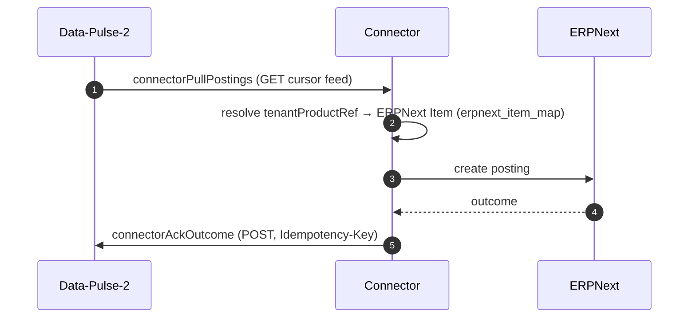
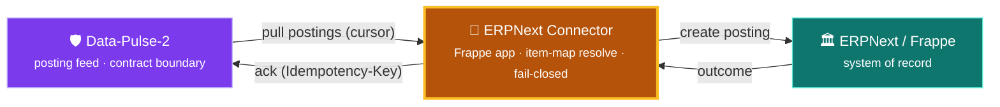

# Synchronization — The ERPNext Connector

> The connector is the **only** component allowed to touch ERPNext. It pulls sale postings from
> Data-Pulse-2, resolves each line to a confirmed ERPNext Item, posts, and acks the outcome.
> It never forks ERPNext, copies its core, or exports catalog out of ERPNext.

<p align="center">
  
</p>

```text
Data-Pulse-2  ──▶  Retail Tower ERPNext Connector  ──▶  ERPNext / Frappe
```

## The connector's direction: capture-UP (posting)

The concrete flow the connector owns is **capture-UP** — sale facts captured in Data-Pulse-2
rise into ERPNext as postings:

| Step | What happens |
|---|---|
| Pull | `connectorPullPostings` — GET the cursor feed of pending postings from Data-Pulse-2 |
| Resolve | Map each sale line's `tenantProductRef` to a confirmed ERPNext Item via DP2's `erpnext_item_map`; fail **closed** on unresolved product / unmapped UOM |
| Post | Create the ERPNext document |
| Ack | `connectorAckOutcome` — POST the outcome back (requires `Idempotency-Key`) |





## Non-goals (explicitly out of scope)

- **No catalog/product export *out of* ERPNext** through this connector — that reverse direction
  is barred (constitution G4); the connector consumes DP2's item map, it does not re-derive it.
- No ERPNext fork · no ERPNext core copied in.
- No direct `POS-Pulse → ERPNext` or `Console → ERPNext`.
- Contract-first and upgrade-safe; Data-Pulse-2 stays the orchestration and contract boundary.

> The diagram above shows both program-level flow colours for family consistency; the
> connector's **own** current scope is the capture-UP posting path described here.

Program-wide view: the
[Retail-Tower-Orchestrator](https://github.com/ahmed-shaaban-94/Retail-Tower-Orchestrator)
control plane.

> Architecture is stable; this document does not assert feature/merge status. See `specs/**`
> and `CLAUDE.md` for the authoritative implementation state (much of the connector is
> spec/policy at this stage; connector code lands in spec 006).
